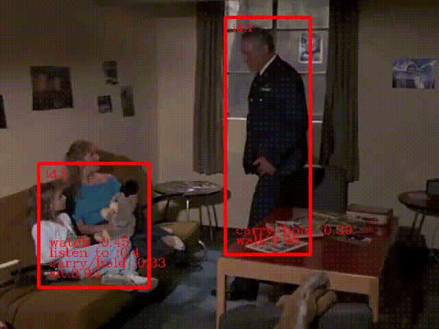

# SlowFast-Network-pytorch
An easy PyTorch implement of SlowFast-Network ["SlowFast Networks for Video Recognition"](https://arxiv.org/abs/1812.03982).

We also complete a real-time action detection demo. The demo is orgnized as：

```bash
         Yolo v3  
            │    
            │
         deepsort  
            │      
            │ 
     SlowFast Network
 ```
## Display the demo results
          |
:-------------------------:|
    |
   |


## Run the demo on your own data
1.Clone the repository
```bash
git clone https://github.com/MagicChuyi/SlowFast-Network-pytorch.git
```
2.Download Yolo v3 model: 
https://pan.baidu.com/s/1tT2uzI44KD3zzAgMskU1Aw

3.Download DeepSort re-id model: 
https://pan.baidu.com/s/1D1_Lw_lq-O75xFX-zFEEbg

4.Download Pre-trained SlowFast Network model: 
https://pan.baidu.com/s/17GLB2k3VhPgRsVCadVmjaA

5.Modify the model path and your video path in video_demo.py.

6.Run video_demo.py.


## Train your own model
1.Download AVA dataset.

2.Discard corrupted data.

3.Dataset should be orgnized as：  
```
ava/ava
│    │ preproc_train  
│    │    │ clips
│    │    │ keyframes
│    │    │ ava_train_v2.2.csv
│    │ preproc_val  
     │    │ clips 
     │    │ keyframes 
     │    │ ...   
```
4.Modify the params in config.py and train_config.py. 

5.Run train_video.py.


## Requirements
python 3  
PyTorch >= 1.0  
tensorboardX  
OpenCV  
## Code Reference:
[1] https://github.com/Guocode/SlowFast-Networks/  
[2] https://github.com/potterhsu/easy-faster-rcnn.pytorch 


Here's some testing made me successfully run the demo:

1.First, you should run python support/setup.py build the complete tools .
2.Maybe you use csv file from https://github.com/kevinlin311tw/ava-dataset-tool?
Because I haven't find ava_action_list_v2.0.csv in official files.
3.Then I change the files we may used to my own path. And I can run the video_demo.py.


(1)存放检测器代码的文件夹，我们就能使用git追踪它们的改变。
##Darknet.py
Darknet 是构建 YOLO 底层架构的环境，这个文件将包含实现 YOLO 网络的所有代码
## util.py
它会包含多种需要调用的函数。在将所有这些文件保存在检测器文件夹下后，我们就能使用 git 追踪它们的改变。

(2)配置文件
官方代码（authored in C）使用一个配置文件来构建网络，即 cfg 文件一块块地描述了网络架构。如果你使用过 caffe 后端，那么它就相当于描述网络的.protxt 文件。
我们将使用官方的 cfg 文件构建网络，它是由 YOLO 的作者发布的。我们可以在以下地址下载，并将其放在检测器目录下的 cfg 文件夹下。
配置文件下载：https://github.com/pjreddie/darknet/blob/master/cfg/yolov3.cfg

(3)